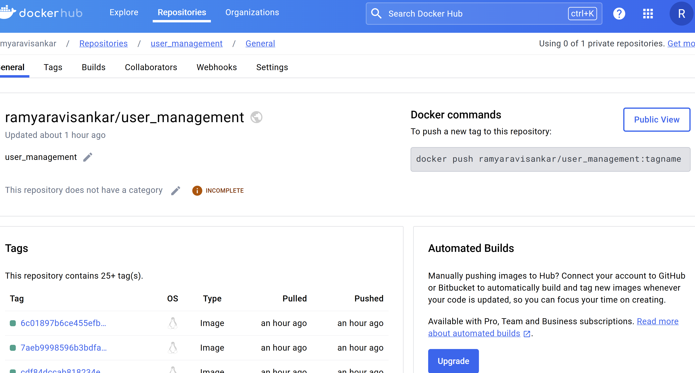
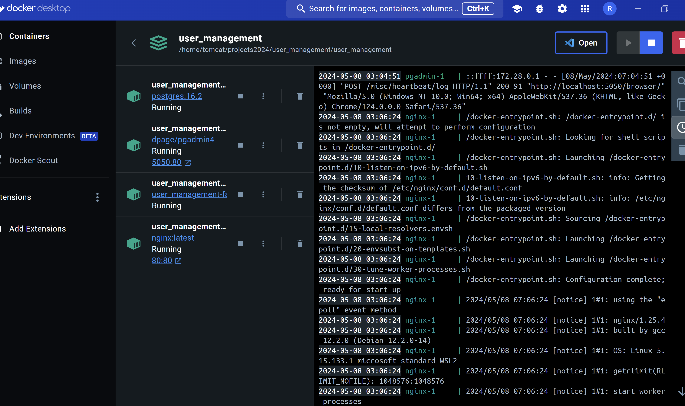

# USER MANAGEMENT - FINAL PROJECT - SPRING 2024

## Issues :

[Issues](Images/Issues.png)

## Issues - Fixes provided and File Changes Information :

[Issue_1]([Issue_1 - Email Verification Fix](https://github.com/Ramya-Ravisankar/user_management/issues/9))

[Issue_2]([Issue_2 - Missing Parameter Check](https://github.com/Ramya-Ravisankar/user_management/issues/10))

[Issue_3]([Issue 3 - Request and Response mismatch](https://github.com/Ramya-Ravisankar/user_management/issues/11))

[Issue_4]([Issue 4 - Validate Skip and limit integer parameters](https://github.com/Ramya-Ravisankar/user_management/issues/12))

[Issue_5]([Issue 5 - Password Field Validation](https://github.com/Ramya-Ravisankar/user_management/issues/13))

## - New Feature - User Profile Management
[User_Profile_Management]([User Profile Management](https://github.com/Ramya-Ravisankar/user_management/issues/14))

[Github_Actions_Link](https://github.com/Ramya-Ravisankar/user_management/actions)

[Github_Commits_Link](https://github.com/Ramya-Ravisankar/user_management/commits/main/)

[Docker_Hub_Link](https://hub.docker.com/repository/docker/ramyaravisankar/user_management)

## Test Coverage :
